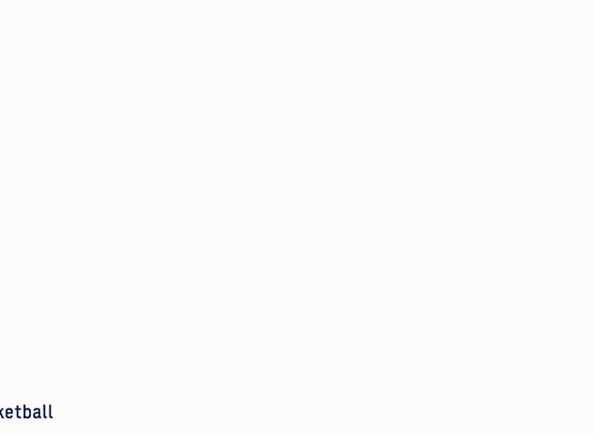
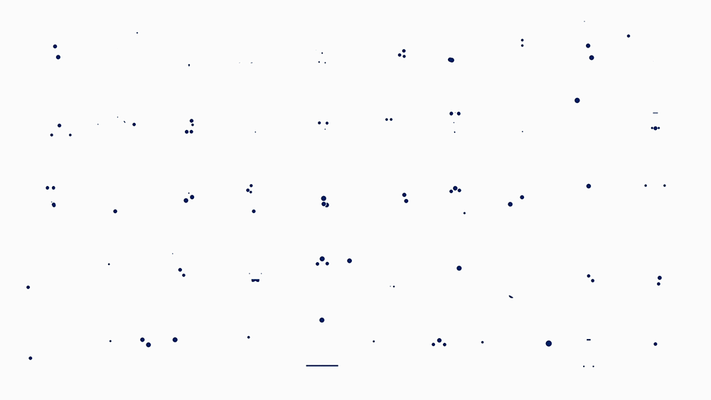

# 🏹 Archery

<div align=center></div>

<!--  -->

<div align=center></div>


## 📚目录结构

```
|____src
| |____index.tsx
| |____App.tsx
| |____styles
| | |____ _variables.less(变量和可配置设置)
| | |____ _mixins.less(全局mixins)
| | |____ _function.less
| |____components
| | |____Button
| | | |____button.test.tsx
| | | |____style.less(组件单独样式)
| | | |____button.tsx
| | |____...
```
## 色彩体系

- 系统色板 = 基础色板 + 中性色板
- 产品色板 = 品牌色 + 功能色板

因个人能力有限，先采用tailwindCSS的默认调色板🎨，后续依实际情况更新。

## 开发历程

- 8.7 button具备基础样式
- 进度得推动起了
